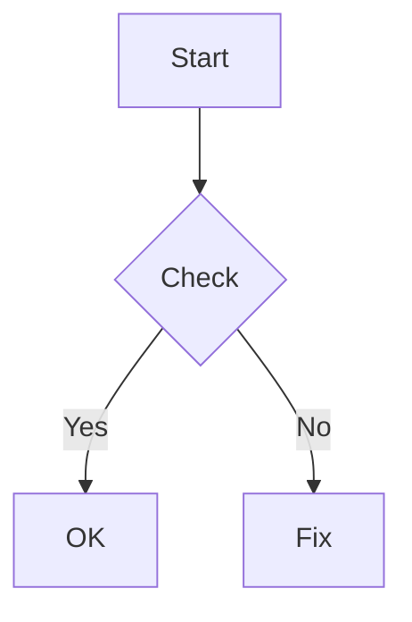

# BlogWeb 项目详解

本文档面向维护者与作者，覆盖：项目开发逻辑、实现功能、使用方式、发布流程、页面调整与代码解读。

## 1. 项目概览

- 类型：Hugo 静态站点
- 站点形态：简历式首页 + 博客列表 + 文章详情 + 标签页
- 入口配置：`hugo.toml`
- 内容目录：`content/`
- 模板目录：`layouts/`
- 样式目录：`assets/css/custom.css`
- 静态资源：`res/`（通过 `staticDir` 挂载为站点资源）

## 2. 目录结构与职责

- `content/_index.html`：首页内容（简历/个人介绍），由 `layouts/index.html` 渲染
- `content/posts/`：博客文章内容
  - `_index.md`：Posts 列表页标题与描述
  - `post-xx.md`：具体文章（含 front matter）
- `layouts/_default/baseof.html`：全站基础骨架（HTML 结构、导航、页脚）
- `layouts/index.html`：首页内容布局
- `layouts/posts/list.html`：/posts 列表布局（卡片网格）
- `layouts/posts/single.html`：文章详情布局（正文 + TOC + 上下篇）
- `layouts/_default/list.html`：其他列表页兜底模板
- `layouts/_default/single.html`：非 posts 的单页兜底模板
- `layouts/_default/terms.html`：标签云页面（/tags）
- `layouts/_default/taxonomy.html`：单个标签页面（/tags/<tag>）
- `layouts/partials/head.html`：字体、CSS、KaTeX 引入
- `layouts/partials/foot.html`：KaTeX/mermaid 脚本初始化
- `assets/css/custom.css`：全站样式（配色、排版、卡片、简历版式等）
- `.github/workflows/hugo.yml`：GitHub Actions 发布流程

## 3. 渲染逻辑（开发工作流）

Hugo 采用“内容 + 模板 + 配置”的渲染模型：

1) 读取配置 `hugo.toml`（站点信息、permalinks、参数、markup 设置）。
2) 读取 `content/` 里的内容（Markdown / HTML）。
3) 按 Hugo 的模板查找规则匹配到 `layouts/` 中的模板。
4) 模板拼装 HTML，CSS 由 Hugo Pipes 处理并指纹化。
5) 输出静态文件到 `public/`（本地或 CI 环境）。

该项目的实际渲染路径：
- 首页 `/`：`layouts/index.html` + `content/_index.html`
- 文章列表 `/posts/`：`layouts/posts/list.html` + `content/posts/_index.md`
- 文章详情 `/posts/<slug>/`：`layouts/posts/single.html` + `content/posts/*.md`
- 标签云 `/tags/`：`layouts/_default/terms.html`
- 单标签页 `/tags/<tag>/`：`layouts/_default/taxonomy.html`

## 4. 功能点说明

### 4.1 文章列表
- 卡片式网格布局（`layouts/posts/list.html`）。
- 显示：日期、阅读时间、标题、summary。
- `summary` 的来源：`front matter` 的 `summary` 优先，其次使用 Hugo 自动摘要。

### 4.2 文章详情
- 标题 + 日期 + 更新日期 + 阅读时间 + 字数统计。
- 标签行：`tags` 生成 `#tag` 链接。
- 目录 TOC：从 `.TableOfContents` 生成侧栏目录（大屏时悬浮）。
- 上一篇/下一篇：`PrevInSection` / `NextInSection`。

### 4.3 标签系统
- `hugo.toml` 中定义了 `tag = "tags"`。
- 标签云页展示全部标签与文章数。
- 单标签页展示该标签下所有文章。

### 4.4 数学公式与图表
- `params.katex = true` 时加载 KaTeX（`layouts/partials/head.html` 和 `foot.html`）。
- `params.mermaid = true` 时加载 Mermaid，并自动转换 ```mermaid 代码块。

### 4.5 样式系统
- CSS 使用 `assets/css/custom.css`，通过 Hugo Pipes `minify | fingerprint` 输出。
- 视觉风格为“浅色纸张质感 + 宋体风格”。

## 5. 配置说明（hugo.toml）

关键配置：
- `baseURL`：站点根路径（GitHub Pages 时是 `https://<user>.github.io/<repo>/`）。
- `permalinks.posts`：文章固定链接规则。
- `staticDir = ["static", "res"]`：将 `res/` 作为静态资源目录。
- `params.katex / params.mermaid`：开关数学公式与图表。
- `markup.highlight`：代码高亮设置。

本地开发时可用 `hugo.server.toml` 覆盖 `baseURL`：

```bash
hugo server -D --config hugo.toml,hugo.server.toml
```

## 6. 内容写作方式

### 6.1 新建文章
在 `content/posts/` 下新增一个 Markdown 文件，例如：

```yaml
---
title: "我的新文章"
date: 2026-01-22
summary: "一句话摘要"
tags: ["标签1", "标签2"]
---
```

正文直接写 Markdown 即可。

### 6.2 图片引用
- 图片放在 `res/images/`，浏览器访问路径是 `/blog/images/<file>`（依赖 baseURL）。
- 例：``。

### 6.3 数学公式
- 直接写 `$...$` 或 `$$...$$`。

### 6.4 Mermaid 图表
- 使用 ```mermaid 代码块即可。

## 7. 本地开发与预览

```bash
hugo server -D --config hugo.toml,hugo.server.toml
```

说明：
- `-D` 显示草稿（`draft: true`）文章。
- 未来日期文章默认不显示，需 `-F`（或调整日期）。

## 8. 发布流程（GitHub Pages）

### 8.1 自动发布
- `.github/workflows/hugo.yml` 定义 CI 流程。
- 触发条件：`main` 分支推送或手动触发。
- 使用 Hugo `0.123.7`（extended）构建。
- 输出目录：`public/`，上传并部署到 GitHub Pages。

### 8.2 发布步骤
1) 本地写作并提交：
   - `git add .`
   - `git commit -m "new post"`
   - `git push`
2) GitHub Actions 自动构建并发布。
3) 等待 Pages 更新完成即可访问。

## 9. 页面调整与定制指南

### 9.1 首页内容
- 编辑 `content/_index.html`。
- 结构为 HTML，可自由调整“简历”内容、链接、标签等。

### 9.2 列表页布局
- `layouts/posts/list.html` 控制 `/posts` 卡片布局。
- 可调整：标题、摘要显示策略、阅读时间显示格式。

### 9.3 文章详情页
- `layouts/posts/single.html` 控制文章页结构。
- 可调整：元信息显示、TOC 显示、上一/下一篇模块。

### 9.4 标签页
- `layouts/_default/terms.html` 控制标签云。
- `layouts/_default/taxonomy.html` 控制标签列表页。

### 9.5 全局样式
- `assets/css/custom.css` 是唯一样式入口。
- 常用可调项：
  - 颜色变量：`:root` 中 `--bg`、`--ink`、`--paper`。
  - 字体：`--font-serif`、`--font-sans`。
  - 卡片样式：`.card`、`.card-grid`。
  - 简历模块：`.resume-*`。

### 9.6 导航与页脚
- `layouts/_default/baseof.html` 控制顶部导航与底部版权。
- 页脚内容由 `hugo.toml` 中 `params.footer` 控制。

## 10. 代码解读（核心模板）

### 10.1 `layouts/_default/baseof.html`
作用：全站 HTML 框架。包含：
- `<head>` 的 title 逻辑（首页用站点名，其他页用“页面标题 + 站点名”）。
- 顶部导航（Home/Posts/Tags），通过 `.IsHome` / `.Section` / `.Kind` 判断激活状态。
- `<main>` 中通过 `{{ block "main" . }}` 注入页面内容。
- 页脚展示 `params.footer`。

### 10.2 `layouts/posts/list.html`
作用：文章列表页（卡片）。
- `range .Pages.ByDate.Reverse` 按日期倒序渲染。
- `.ReadingTime`、`.Summary`、`.Params.summary` 等用于显示 meta。

### 10.3 `layouts/posts/single.html`
作用：文章详情页。
- `.TableOfContents` 自动生成目录。
- `.PrevInSection` / `.NextInSection` 生成上下篇导航。
- `.WordCount` / `.ReadingTime` 提供字数与阅读时间。

### 10.4 `layouts/partials/head.html`
作用：引入字体、CSS 与 KaTeX。
- CSS 通过 Hugo Pipes `resources.Get` 加载并指纹化。

### 10.5 `layouts/partials/foot.html`
作用：KaTeX 与 Mermaid 初始化。
- KaTeX 自动扫描 `$...$` 和 `$$...$$`。
- Mermaid 会把 ```mermaid 代码块转换成图表容器。

## 11. 常见调整示例

- 想增加文章列表显示的字段（比如作者）：改 `layouts/posts/list.html`。
- 想关闭目录：删除 `layouts/posts/single.html` 中 TOC 相关块。
- 想改配色：直接改 `assets/css/custom.css` 的 `:root` 颜色变量。
- 想改首页信息：直接改 `content/_index.html`。

## 12. 注意事项

- 未来日期文章默认不显示，需要 `-F` 或调整日期。
- `baseURL` 与图片路径绑定，若部署路径变动，需同步修改链接与 `baseURL`。
- Hugo Pipes 输出带指纹的 CSS 文件，浏览器不会缓存旧样式。

---

## 13. 写作模板

以下模板可直接复制到新文章文件中（放在 `content/posts/`）：

```yaml
---
title: "文章标题"
date: 2026-01-22
summary: "一句话摘要，尽量 20~40 字"
tags: ["标签A", "标签B"]
draft: false
---
```

正文写作建议：
- 标题建议 10~18 字，突出主题。
- `summary` 用于列表页卡片显示，写清楚这篇文章讲什么。
- `tags` 建议控制在 2~4 个。
- 想暂存不发布，用 `draft: true`，本地预览加 `-D`。

常用内容块示例：

```md
## 小节标题

这里写正文。建议分段、每段 2~4 句。

### 代码

```js
function hello(name) {
  return `Hello ${name}`;
}
```

### 图片


### 引用

> 这是引用内容。

### 公式

$$E=mc^2$$

### Mermaid


```

## 14. 自动发布脚本（不改仓库文件）

如果你不想每次手动输入三条 git 命令，可以在自己电脑的个人目录写一个脚本（不放进仓库），一键构建并推送。

示例（PowerShell，保存为 `C:\Users\你的用户名\bin\blog-publish.ps1`）：  

```powershell
param(
  [string]$Message = "update blog"
)

Set-Location "D:\1\blogweb"

# 构建站点
hugo --minify

# 提交并推送
git add .
git commit -m $Message
git push
```

使用方式：

```powershell
& "C:\Users\你的用户名\bin\blog-publish.ps1" -Message "new post"
```

说明：
- 这个脚本不需要改项目代码。
- 如果 `git commit` 提示没有变更，说明本次没有写入内容。
- 也可以去掉 `hugo --minify`，完全依赖 GitHub Actions 构建。

## 15. 常见问题排查

### 15.1 文章不显示
- 检查日期是否在未来（Hugo 默认不显示未来文章）。
- 本地预览用 `hugo server -F` 查看未来文章。
- 是否放在正确目录 `content/posts/`。

### 15.2 图片不显示
- 图片必须在 `res/` 或 `static/` 下。
- 链接路径是否带 `/blog/`（与你的 `baseURL` 对齐）。
- 部署后图片路径与 `baseURL` 一致。

### 15.3 标签页为空
- 文章 front matter 中是否有 `tags`。
- `hugo.toml` 中确认 `taxonomies` 有 `tag = "tags"`。

### 15.4 CSS 未生效
- `assets/css/custom.css` 是否被修改。
- 本地浏览器缓存可清除后刷新。
- 站点构建后 CSS 会指纹化，不存在长期缓存问题。

### 15.5 KaTeX / Mermaid 不生效
- `hugo.toml` 中 `params.katex` / `params.mermaid` 是否为 `true`。
- 公式和 Mermaid 语法是否正确。
- 本地预览时检查浏览器控制台是否有加载失败（网络或 CDN 问题）。

### 15.6 GitHub Pages 不更新
- Actions 页面查看是否构建失败。
- `baseURL` 是否和仓库 Pages 地址一致。
- 是否推送到 `main` 分支。

 如果你还想把“写作模板”做成可直接 hugo new 的 archetype，或者需要更细的发布脚本（如自动检测是否有改动、自动加日期前缀），告诉我。
